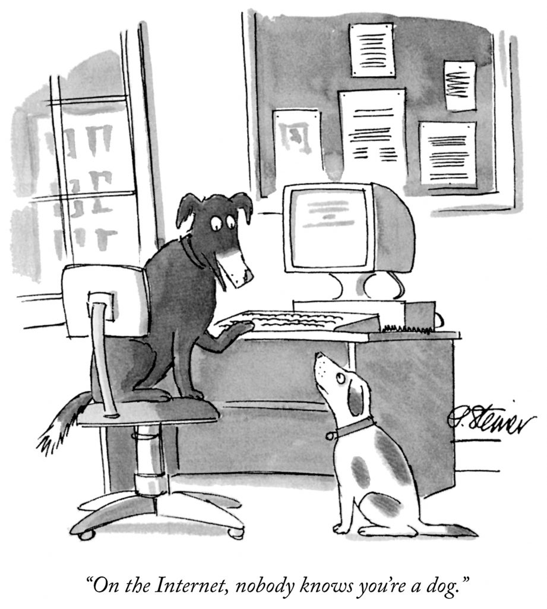

# Connaître: who knows you, anon?

## Intro
Bug bounties are cool because companies can tap into a global talent pool to discover problems. Wouldn't it be *also* be cool if there were a way for anons to tap into a global talent pool of internet snoopers to see if anyone can discover their secret identity?

## Bounty constraints
Here are some constraints imposed by Alice the Anon and Sammy the Snooper.
1. Sammy doesn't trust Alice. When Alice creates the bounty, Sammy must have a guarantee that Alice will pay, otherwise Sammy will not begin snooping.
2. Alice does not want her personal info to be leaked. Therefore, this bounty program must run in a way where the Sammy can prove that they know Alice's public info without publicizing that info to the world Alice's information.

The way to address these constraints is through a smart contract, of course!

## High-level workflow
1. The anon runs the script `script/create-signature.js` and deploys the contract `Connaitre.sol` with the ethereum address `ANON_INFO_ADDRESS` generated in that script. The anon separately sends ERC20 token to the contract to be used as a bounty.
2. The snooper (i.e. prover) finds the personal information of the anon, and they run `script/create-signature.js` to create a signature _from the account associated with `ANON_INFO_ADDRESS`_, and the signature payload is the address where the bounty should be sent (`RECEIVER_ADDRESS`). 
3. The prover then uses the v, r, and s parameters, along with `RECEIVER_ADDRESS`, to invoke `Connaitre.proveKnowledgeAndClaim()`, proving that they know the private key assocated with `ANON_INFO_ADDRESS`. Assuming the contract has sufficient funding, it then sends the bounty to the `RECEIVER_ADDRESS`.

## Use Cases
1. Pretentious people who want some level of comfort knowing that nobody knows their anon identity.

## Mempool considerations
The Connaitre contract has a lump sum payoff to the first to successfully invoke the `proveKnowledgeAndClaim()` function. This is typically cause for concern, since miners snooping in the mempool may use their transaction inclusion and transaction ordering powers to maximize their own bottom line. We address each separately.

**Will miners include a block with this transaction?**
Assuming that the miner is not directly involved in the search for this anon's 

**Will miners modify this transaction's order in the block to their advantage?**
The only way that transaction reordering helps here is if reordering the transactions means the miner can seek rent from (a) submitting the proof themselves, or (b) taking a higher gas fee from a search who submits the proof. However, creating this proof requires that the prover know the private key `K_s` to `ANON_INFO_ADDRESS`. Assuming that mempool snoopers don't have access to `K_s`, no intrablock transaction reordering attacks will occur.

**How would the anon act here?**
If the anon were the miner, then they would have the ability to place their own proof above the prover's proof, sending the bounty back to a wallet controlled by the anon. However this is a super remote possibility that I frankly don't entertain. What's slightly more likely is that the miner is snooping in the mempool and willing to compete in a PGA with the prover once the prover submits their proof. This way, the anon would still be able to learn that somebody has their identity, while not needing to pay out the bounty and instead just paying a high gas fee to a miner.

If the prover is really concerned about this, they can submit their proof transaction to the network via trusted miners on a private relay like Flashbots or Ethermine.

## Contributing
Feel free to contact me on twitter at [@max_holloway](https://twitter.com/max_holloway) or raise an issue here if you think you can help out!

## Donation
If you like this work, don't buy me a coffee. Instead, do me a favor and donate to a [high impact charity](https://www.givewell.org/about/donate/cryptocurrency). 🙏

## Disclosure
This content is provided as-is. This was put together in an afternoon and is not meant to be used in production unless further tested. Tbh this was mostly meant as a fun way for me to learn how to use foundry.
